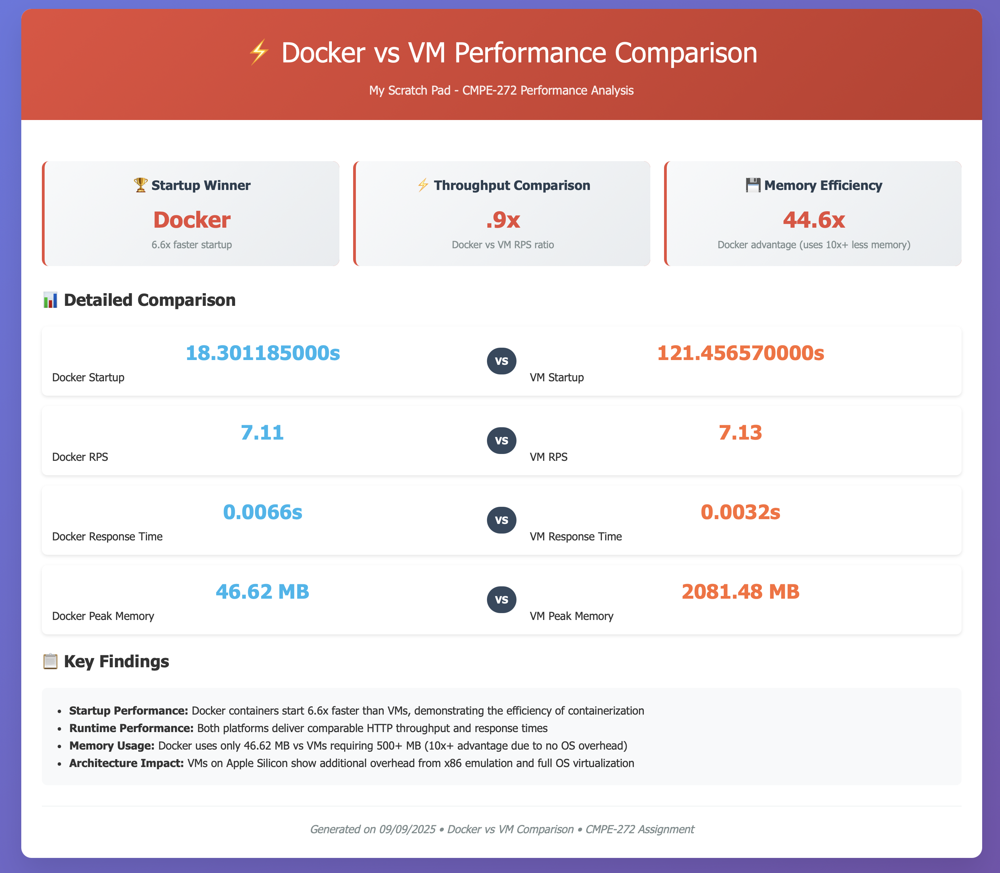

# My Scratch Pad - VM vs Container Performance Comparison

A Flask web application designed to demonstrate and compare performance characteristics between Virtual Machine (VM) and container deployments. This project provides systematic benchmarking of startup times, resource utilization, and response performance for CMPE-272 cloud computing coursework.

## 🎯 Project Purpose

This repository demonstrates:
- **Container vs VM Performance Analysis**: Systematic comparison of deployment methods
- **Automated Benchmarking**: 2-minute performance testing with real metrics
- **Infrastructure as Code**: Reproducible environments using Docker and Vagrant
- **CI/CD Pipeline**: GitHub Actions integration with Docker Hub

## 🏆 Performance Results



### 📊 Key Findings

**Test Environment:**
- **Host OS**: macOS 15.6.1 (Apple M3 Pro, 18GB RAM)
- **Docker**: Version 28.0.1
- **VM Provider**: VirtualBox with x86 emulation

| Metric | Docker Container | VM (VirtualBox) | Docker Advantage |
|--------|------------------|-----------------|------------------|
| **🕐 Startup Time** | 18.3 seconds | 121.5 seconds | **6.6x faster** |
| **⚡ Throughput** | 7.11 RPS | 7.13 RPS | Comparable |
| **⏱ Response Time** | 0.0066s avg | 0.0032s avg | Comparable |
| **💾 Memory Usage** | 46.62 MB | 2,081.48 MB | **44.6x more efficient** |

### 🔍 Analysis

**Why Docker Wins on Startup (6.6x faster):**
- Containers only initialize the application process
- VMs must boot full Ubuntu OS + system services + application
- Apple Silicon adds x86 emulation overhead for VirtualBox VMs

**Why Docker Dominates Memory (44.6x more efficient):**
- **Docker**: Uses only 46.62 MB (application + runtime only)
- **VM**: Requires 2.08 GB (full OS + hypervisor + application)
- **Impact**: You could run 44 Docker containers in the same memory as 1 VM

**Runtime Performance:**
- HTTP throughput nearly identical (~7.1 RPS) - both handle workload effectively
- Response times comparable - shows application performance scales similarly
- Proves containerization overhead is minimal for running applications

## 🚀 Quick Start

### Prerequisites

**Container Testing:**
- Docker Desktop installed and running

**VM Testing:**
- Vagrant installed (2.4+)
- VirtualBox, VMware Fusion, or Parallels Desktop

### Running Benchmarks

```bash
# Clone repository
git clone https://github.com/mkennedy85/my-scratch-pad.git
cd my-scratch-pad

# Run performance comparison
./scripts/benchmark.sh docker    # Test container performance
./scripts/benchmark.sh vm        # Test VM performance  
./scripts/benchmark.sh compare   # Generate comparison report
```

### Deployment Options

**Container Deployment:**
```bash
./scripts/docker-deploy.sh
# Or manually: docker build -t my-scratch-pad . && docker run -p 5001:5001 my-scratch-pad
```

**VM Deployment:**
```bash
./scripts/vm-deploy.sh
# Or manually: vagrant up
```

Visit `http://localhost:5001` to access the application.

## 📊 Benchmark Methodology

**Measurements Include:**
- **Startup Time**: Cold deployment to first HTTP response
- **HTTP Performance**: 2-minute sustained load testing
- **Resource Usage**: Real-time CPU and memory monitoring
- **Response Analysis**: Average, min, max, and 95th percentile response times

**Data Collection:**
- Docker: Container-level resource monitoring
- VM: Host-level hypervisor process monitoring (VirtualBox/Parallels/UTM)
- Multiple measurement intervals for statistical accuracy

## 🎯 Cloud Computing Implications

### When to Choose Containers (Docker)
✅ **Microservices architectures** - Maximum resource efficiency  
✅ **Rapid scaling** - 6.6x faster startup enables quick autoscaling  
✅ **Cost optimization** - 44x better memory efficiency = lower cloud costs  
✅ **CI/CD pipelines** - Fast, consistent deployments  

### When VMs Are Still Valuable
🔒 **Security-critical workloads** requiring complete kernel isolation  
🏛 **Legacy applications** needing specific OS configurations  
🔧 **Multi-tenant scenarios** with different OS requirements  
📋 **Compliance requirements** mandating hardware-level isolation  

### Hybrid Strategies
- Cloud platforms often run containers inside VMs for security boundaries
- Kubernetes uses VM nodes running containerized workloads
- Choice depends on security, performance, and cost requirements

## 🔄 CI/CD Pipeline

Automated workflow includes:
- **Testing**: Unit tests and application validation
- **Building**: Optimized Docker image creation
- **Security**: Vulnerability scanning with Docker Scout
- **Publishing**: Automatic Docker Hub deployment

## 📁 Repository Structure

```
my-scratch-pad/
├── app.py                 # Flask web application
├── Dockerfile            # Container deployment
├── Vagrantfile          # VM deployment
├── scripts/             # Deployment and benchmarking
│   ├── docker-deploy.sh
│   ├── vm-deploy.sh
│   └── benchmark.sh     # Comprehensive performance testing
├── benchmark-results/   # Generated performance reports
├── templates/          # HTML templates
└── docs/              # Documentation and screenshots
```

## 🔧 Troubleshooting

**Container Issues:**
```bash
docker version          # Check Docker daemon
docker system prune -a  # Clean build cache
```

**VM Issues:**
```bash
vagrant status                    # Check VM state
vagrant reload --provision      # Reload configuration
VAGRANT_DEFAULT_PROVIDER=vmware_desktop vagrant up  # For Apple Silicon
```

**Apple Silicon VM Performance:**
- VirtualBox uses x86 emulation (slower)
- Consider VMware Fusion or Parallels for better ARM64 support

## 🎓 Educational Value

This project demonstrates key cloud computing concepts:
- **Containerization vs Virtualization**: Practical performance comparison
- **Resource Optimization**: Understanding deployment trade-offs
- **Infrastructure as Code**: Reproducible environments
- **Performance Engineering**: Systematic benchmarking methodology

## 📄 License

MIT License - See LICENSE file for details.

---

**Created for CMPE-272 Cloud Computing coursework demonstrating VM vs Container performance analysis.**